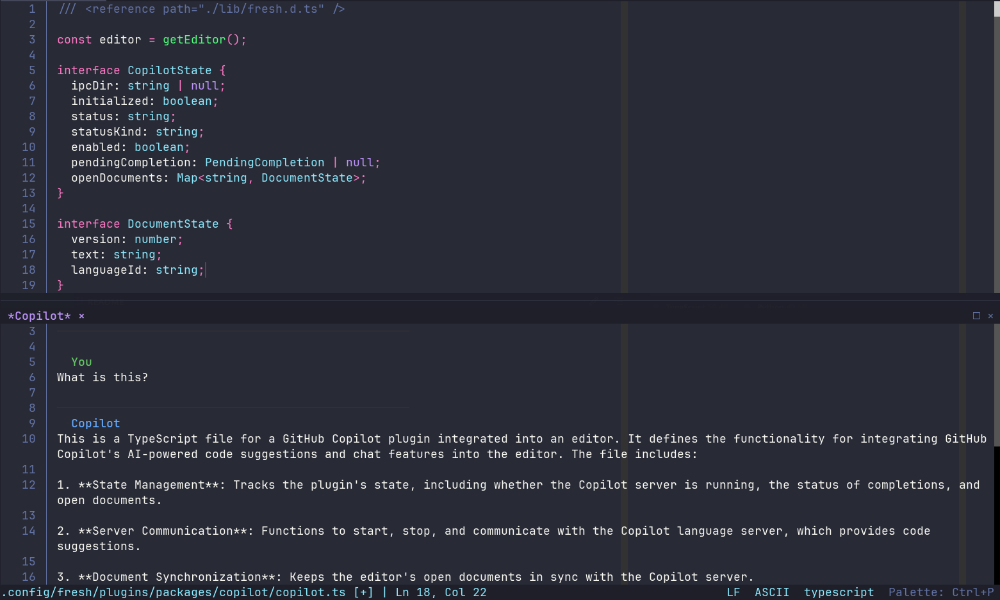
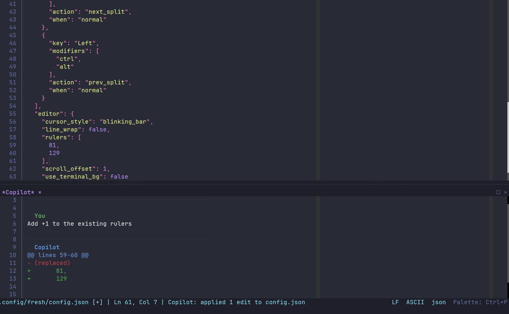

# Fresh Copilot

GitHub Copilot plugin for the [Fresh](https://github.com/sinelaw/fresh) terminal based IDE & text editor.

Provides inline ghost text completions and a chat panel, both powered by the official [Copilot Language Server](https://github.com/github/copilot-language-server-release).

## Examples

*Asking Copilot a question about the open file*


<br>

*Copilot proposing and applying edits directly in the file*


## Requirements

- Python 3.6+
- [Copilot Language Server](https://github.com/github/copilot-language-server-release):
  ```sh
  npm install @github/copilot-language-server
  ```
- A [GitHub Copilot subscription](https://github.com/features/copilot) (free tier works)

## Features

- **Ghost text completions** - suggestions appear inline as you type, accepted with Tab
- **Chat panel** - ask Copilot questions about the file you have open
- **Inline edits** - Copilot can edit the file directly from chat, with full undo support
- **Status bar indicator** - shows connection state and last action
- **Sign in/out** from inside the editor

## Setup

Copy _(or symlink)_ this folder to `~/.config/fresh/plugins/packages/copilot/`.

The plugin auto-starts when the language server is found. On first use run `Copilot: Sign In` from the command palette and follow the browser flow.

## Commands

| Command | Default key | Description |
|---------|-------------|-------------|
| `Copilot: Start` | | Start the Copilot server |
| `Copilot: Stop` | | Stop the Copilot server |
| `Copilot: Sign In` | | Authenticate with GitHub |
| `Copilot: Sign Out` | | Sign out |
| `Copilot: Toggle` | | Enable / disable completions |
| `Copilot: Status` | | Show current status |
| `Copilot: Ask` | Ctrl+Alt+C | Open the chat panel |
| `Copilot: Accept Completion` | Ctrl+Eenter | Accept inline suggestion |
| `Copilot: Dismiss Completion` | | Dismiss inline suggestion |

## Architecture

```
copilot.ts             - Fresh plugin (UI, keybindings, IPC glue)
copilot_server.py      - LSP bridge for inline completions
copilot_chat_server.py - HTTP chat bridge (talks to Copilot Chat API)
```

Logs: `~/.cache/fresh/copilot-server.log`

## Known Issues

- **Space before ghost text** - inline suggestions appear with a leading space. This seems to be a quirk in Fresh itself.
- **Line numbers visible in chat panel** - the chat panel shows line numbers even though none are needed. As there doesn't seem to be a way for plugins to override per-split display settings (Fresh appears to copy them from global config when creating a virtual buffer in a split), this can't be worked around from the plugin side.
- **Rulers visible in chat panel** - same issue as above.
- **Chat panel shows a tab** - the panel appears as a regular tab in the tab bar. `hiddenFromTabs` is not available for `createVirtualBufferInSplit`, so there is currently no way to hide it.
- **Undo applies in two steps** - each edit hunk from Copilot chat is a delete followed by an insert, so undoing requires two Ctrl+Z presses per hunk. There is no batch/atomic edit API available in Fresh plugins at this time.
